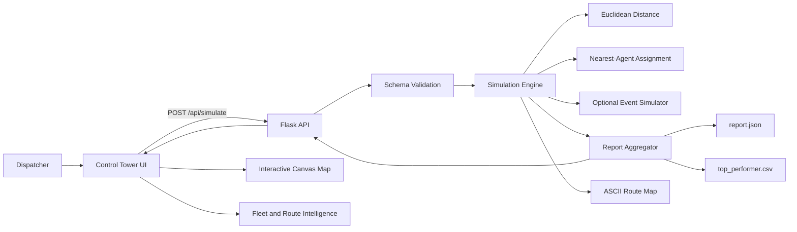
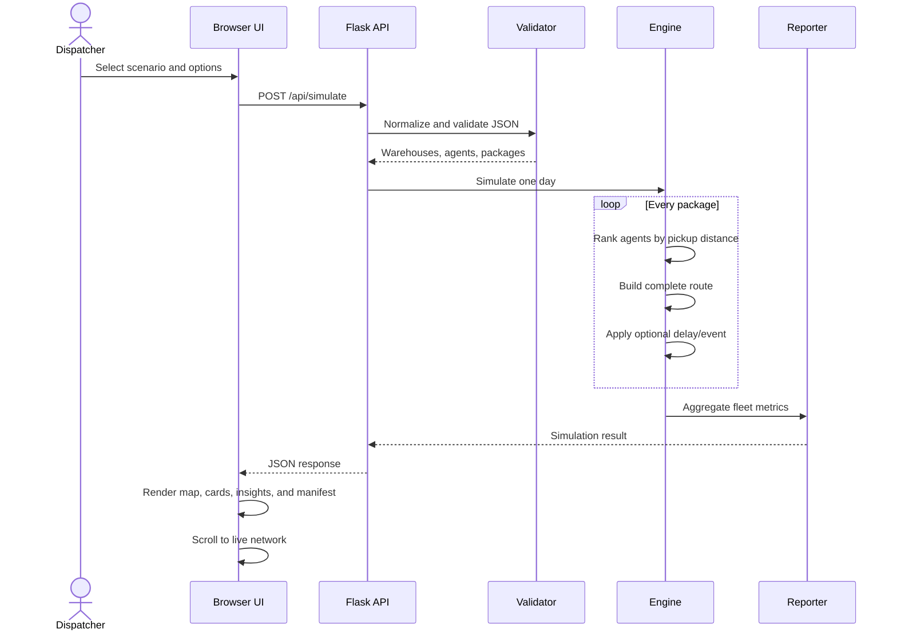
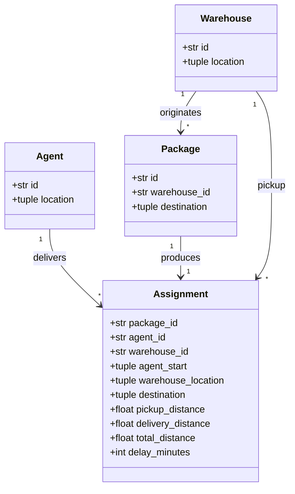

# FastBox Delivery Intelligence

An interactive last-mile control tower and deterministic logistics simulation
engine built for the **Mystery Delivery System** Python assignment.

FastBox turns warehouse, agent, and destination coordinates into a complete
one-day operating plan: every package is assigned to its nearest agent, every
route is measured, and fleet performance is ranked. The core remains a clean
Python implementation while the product layer adds a polished, responsive
operations experience.

**Live product:** https://fastbox-delivery-intelligence.vercel.app

## Highlights

- Exact Euclidean nearest-agent assignment
- Complete `agent → warehouse → destination` route accounting
- Interactive control map with collision-aware marker layout
- Cursor-centred zoom, drag-to-pan, fit-to-network, and route-layer filters
- Live courier movement, route distances, fleet focus, and package drill-down
- JSON scenario upload, eleven supplied test cases, validation, and report export
- Seeded random delays and a mid-day agent arrival simulator
- Dependency-free ASCII route visualization
- Top-performer CSV export
- Responsive, accessible control-tower interface
- Comprehensive automated tests and deterministic tie-breaking

## Quick start

```bash
git clone https://github.com/Divyanshu0230/FastBox-Delivery-Intelligence.git
cd FastBox-Delivery-Intelligence

python3 -m venv .venv
source .venv/bin/activate
pip install -r requirements.txt
python app.py --serve
```

Open **http://127.0.0.1:5050**.

## Product experience

1. Choose one of the supplied operating scenarios or upload a JSON manifest.
2. Optionally enable traffic delays or a mid-day agent arrival.
3. Select **Generate route plan**.
4. The interface moves directly to the control map.
5. Inspect routes, zoom around the network, drag to pan, click any marker, focus
   an agent, search the manifest, and export the operation.

The map keeps the original coordinate relationships while applying a small,
deterministic collision-resolution pass in screen space. Dense package clusters
remain readable without changing any routing calculation.

## Assignment requirements

### Core requirements

- **Read and parse JSON:** Python's `json` module reads both schemas included in
  the assignment pack.
- **Nearest-agent assignment:** every package is assigned using Euclidean
  distance from each agent's starting position to the package warehouse.
- **Delivery simulation:** each route contains a pickup leg and a delivery leg.
- **Performance report:** delivered package count, distance, efficiency, and the
  best agent are saved to `report.json`.
- **Input invariant:** every valid package is delivered exactly once.

### Bonus requirements

- **Random delivery delays:** seeded and bounded for reproducible demonstrations.
- **ASCII route visualization:** prints agents, warehouses, destinations, pickup
  legs, and delivery legs without third-party libraries.
- **New agent joining mid-day:** the agent becomes eligible after a configurable
  number of package assignments.
- **Top performer CSV:** exports one auditable winner row with package IDs and
  performance metrics.

## CLI

Run the required simulation and create `report.json`:

```bash
python app.py base_case.json
```

Run every bonus together:

```bash
python app.py base_case.json \
  --random-delays \
  --seed 42 \
  --max-delay 45 \
  --join-agent AX 50 50 \
  --joins-after 3 \
  --ascii \
  --top-performer-csv top_performer.csv
```

Run another supplied case:

```bash
python app.py \
  "Python Assignment(Delivery System Test Cases)/test_case_10.json" \
  --output report.json
```

## Input schemas

The mapping schema from the brief:

```json
{
  "warehouses": {
    "W1": [0, 0],
    "W2": [50, 75]
  },
  "agents": {
    "A1": [5, 5],
    "A2": [60, 60]
  },
  "packages": [
    {
      "id": "P1",
      "warehouse": "W1",
      "destination": [30, 40]
    }
  ]
}
```

The list schema in `base_case.json` is normalized to the same domain model:

```json
{
  "warehouses": [{"id": "W1", "location": [0, 0]}],
  "agents": [{"id": "A1", "location": [5, 5]}],
  "packages": [
    {
      "id": "P1",
      "warehouse_id": "W1",
      "destination": [30, 40]
    }
  ]
}
```

## Algorithm

For package `p`, warehouse `w`, and candidate agent `a`:

```text
pickup_distance(a, w) = √((wx − ax)² + (wy − ay)²)
delivery_distance(w, p) = √((px − wx)² + (py − wy)²)
route_distance = pickup_distance + delivery_distance
assigned_agent = argmin(pickup_distance)
efficiency = total_agent_distance / packages_delivered
```

Agent ID is the deterministic tie-breaker when two pickup distances are equal.
The best active agent has the lowest efficiency value.

### Complexity

Let `P` be packages and `A` be agents:

- Assignment time: **O(P × A)**
- Report aggregation: **O(P + A)**
- Domain storage: **O(P + A + W)**

The browser's collision-aware visual layout is separate from the business
algorithm and does not affect assignments or report values.

## High-level design



## Request lifecycle



## Low-level design



### Python boundaries

- `parse_input` validates and converts external JSON into immutable domain models.
- `euclidean_distance` owns the distance rule.
- `nearest_agent` owns assignment ranking and tie-breaking.
- `simulate` orchestrates routes, optional events, and aggregation.
- `generate_report` creates the assignment-compatible output shape.
- `render_ascii_routes` creates the terminal visualization.
- `export_top_performer_csv` owns winner export.
- Flask routes only translate HTTP requests and responses.

### Frontend boundaries

- Scenario state and API orchestration
- Operational KPI rendering
- Collision-aware map layout
- Unified map viewport transform for roads, routes, agents, hubs, and drops
- Zoom-at-cursor, pan, fit, filtering, and route selection
- Fleet focus, searchable manifest, notifications, and JSON export

## API

### Health

```http
GET /api/health
```

### Available scenarios

```http
GET /api/cases
```

### Simulate

```http
POST /api/simulate
Content-Type: application/json
```

```json
{
  "case": "test_case_10.json",
  "options": {
    "random_delays": true,
    "seed": 42,
    "max_delay_minutes": 45,
    "joining_agent": {
      "id": "AX",
      "location": [50, 50]
    },
    "joins_after": 3
  }
}
```

Custom data can be posted with `"data": { ... }` instead of `"case"`.

## Output artifacts

`report.json` uses the assignment-compatible shape:

```json
{
  "A1": {
    "packages_delivered": 2,
    "package_ids": ["P1", "P4"],
    "pickup_distance": 14.14,
    "delivery_distance": 64.14,
    "total_distance": 78.28,
    "efficiency": 39.14,
    "delay_minutes": 0
  },
  "best_agent": "A3"
}
```

The API returns richer summary, network, route, methodology, and event objects
needed by the control tower.

> **Correctness note:** the example totals printed in the assignment brief do not
> arithmetically follow its stated Euclidean `agent → warehouse → destination`
> rule. FastBox derives every total from the supplied coordinates instead of
> hard-coding the illustrative sample. The calculation is isolated and tested.

## Validation and safety

The parser rejects:

- Missing top-level fields
- Empty warehouse or agent collections
- Malformed or non-finite coordinates
- Duplicate package or entity IDs
- Packages referencing unknown warehouses
- Invalid event options
- Duplicate joining-agent IDs
- Path traversal attempts against supplied scenarios

Uploaded IDs are escaped before HTML rendering. Supplied scenario access is
allow-listed. Calculations retain full precision and round only at report
boundaries.

## Testing

```bash
pytest -q
```

Coverage includes:

- Euclidean distance
- Deterministic tie-breaking
- Both input schemas
- Known package-to-agent assignments
- All eleven supplied datasets
- Delivery-count invariants
- Invalid-input failures
- Seeded delay reproducibility
- Mid-day agent arrival
- ASCII visualization
- CSV export
- Bonus options through the HTTP API

## Project structure

```text
.
├── app.py
├── base_case.json
├── Python Assignment(Delivery System Test Cases)/
│   ├── test_case_1.json
│   └── ... test_case_10.json
├── templates/
│   └── index.html
├── static/
│   ├── control-tower.css
│   └── control-tower.js
├── tests/
│   └── test_app.py
├── requirements.txt
├── vercel.json
└── README.md
```

## Deployment

The repository is configured for Vercel's Python runtime:

```bash
vercel
vercel --prod
```

No database or environment variables are required.

## Engineering decisions

- Standard-library domain engine; Flask is limited to delivery over HTTP.
- Immutable domain models reduce accidental state mutation.
- Required behavior stays deterministic unless bonus events are explicitly enabled.
- Visual collision resolution never mutates business coordinates.
- Map roads, routes, and markers share one viewport transform.
- Reduced-motion preferences are respected.
- Inactive agents are excluded from winner ranking.
- UI controls remain keyboard accessible and responsive.

## License

Created as a software-engineering assignment and portfolio demonstration.
